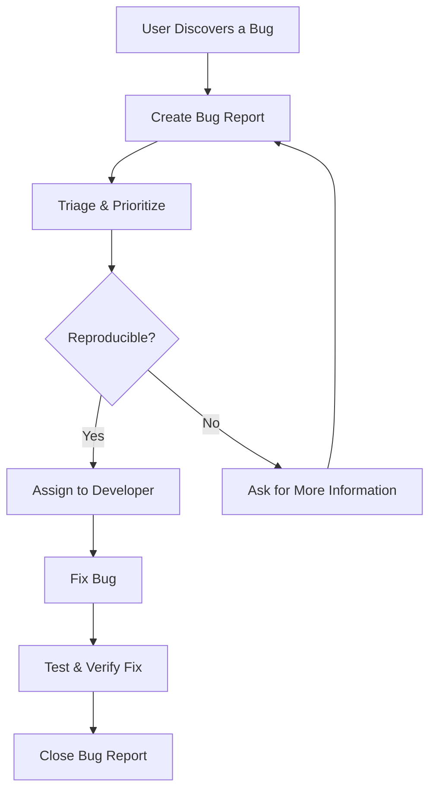

### **Priority Level**
**Instructions:** Please select a priority from P0 to P9. The default is P5.
* **P9** = Highest Priority (Critical/Urgent)
* **P5** = Medium Priority (Default)
* **P0** = Lowest Priority

_Please use P9 sparingly for critical issues, as a high number of P9 bugs devalues their urgency._

Priority Level = P5

### **Issue Details**
**Instructions:** The more details you provide, the faster we can resolve the issue. Please describe the problem using the questions below as a guide.

- What happened?
- What were you trying to do?
- What was the expected outcome?
- Where did you encounter the issue (e.g., URL, specific page)?
- When did the issue first occur?

### **Screen Capture or Video Recording**
**Instructions:** Please attach a screen capture or video recording to help us understand the issue. When capturing, please include the entire browser window, including the address bar.

### **Relevant Information**
**Instructions:** If applicable, please provide any previous support tickets, names of engineers, or other related context.

