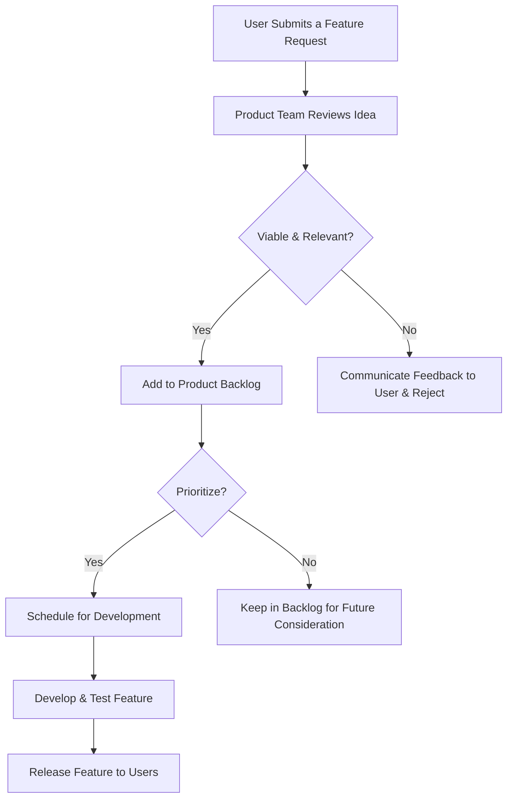

### **Feature Details**
**Instructions:** The more details you provide, the better we can understand and evaluate your request.

* What is the proposed feature?
* What problem would this feature solve?
* Who would benefit from this feature?
* Describe the user flow or how you envision using this feature.

### **Priority Level**
**Instructions:** Please select a priority from P0 to P9. The default is P5.
* **P9** = Highest Priority (Critical/Urgent)
* **P5** = Medium Priority (Default)
* **P0** = Lowest Priority

_Please use P9 sparingly, as a high number of P9 requests devalues their urgency._

Priority Level = P5

 
 
 

